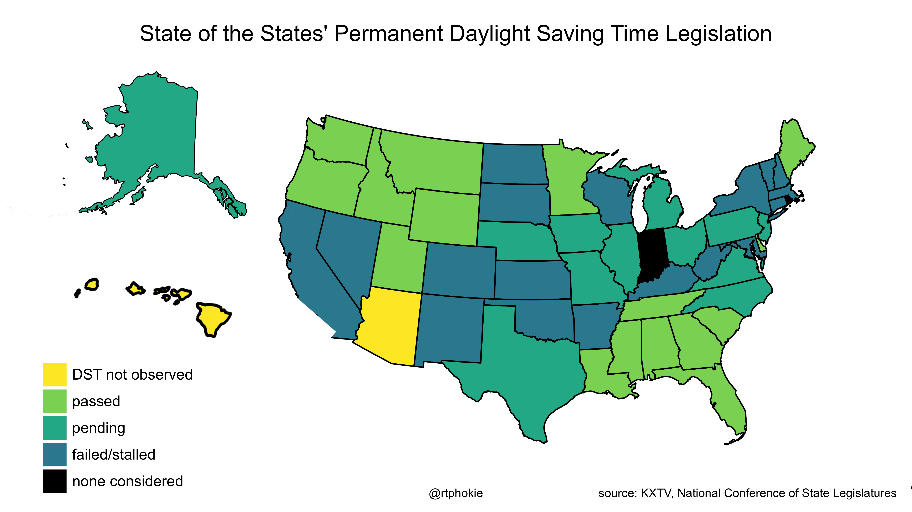

Daylight Saving Time has been around since 1916 when Germany adopted the practice as a way to conserve fuel during World War I.  Since then it has been adopted, and abandoned, sometimes several times, worldwide.

The story of daylight saving is bound in the story of timezones.  Prior to their introduction in the late 1800s, time was based on local noon (when the )

A standard for timezones is maintained by the Internet Assigned Numbers Authority (IANA) (see data sources below).  That database exists in various forms on most operating systems to aid in displaying 
The history of daylight saving actually exists on 

# Methodology

### DST history
Parsed from [Time Zone Database rules files](https://www.iana.org/time-zones) distributed by the by the Internet Assigned Numbers Authority (IANA) and maintained by  Paul Eggert (primary) and Tim Parenti (secondary).
Note, these are also locally available on every Linux and Mac computer (Microsoft does their own thing) via the zdump command.  Syntax:

    % zdump -v America/New_York

### DST Legislation

Choropleth map of 50 US states showing the state of legislation (passed, under consideration, failed or stalled, or not considered at all) to adopt permanent daylight saving time.
Under federal law, any state may choose not to observe daylight saving time, as Arizona and Hawaii have, a change in the law is necessary before any of these state laws can be put into effect.

# Data Sources
### Timezone & Day Light Saving history:
* Time Zone Database [Internet Assigned Numbers Authority (IANA)](https://www.iana.org/time-zones)
* /usr/share/zoneinfo (local version of the IANA data avialable on all Linux, BSD, etc.)
* [zdump (8)](https://man7.org/linux/man-pages/man8/zdump.8.html) tool for dumping zoneinfo files
* DST legislation in the United States: [National Conference of State Legislatures](https://www.ncsl.org/research/transportation/daylight-savings-time-state-legislation.aspx) & [KXTV](https://www.abc10.com/article/news/nation-world/daylight-saving-time-bill-status-all-50-states/507-25ff8777-63bc-423f-895d-22f5a3d5d28c)

### Cartographic:
* [US Census Bureau: Cartographic Boundary Files](https://www.census.gov/geographies/mapping-files/time-series/geo/carto-boundary-file.html) public domain
* [Eric Muller: shapefile of the TZ timezones of taccessinghe world](http://efele.net/maps/tz/world/) CC0 - Creative Commons